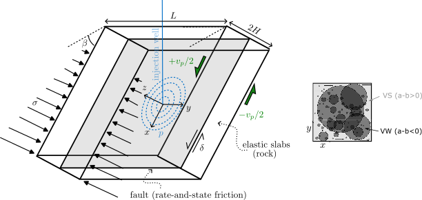
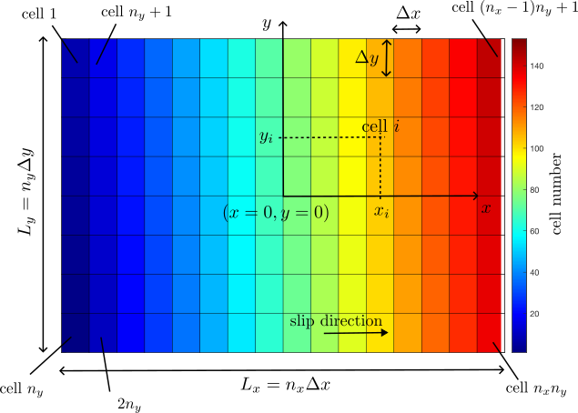

# Introduction

CYCLAPS (earthquake CYCLe simulator for Asperities under Poroelastic
Stressing) is an earthquake simulator based on rate-and-state friction
and quasi-dynamic elasticity. It allows to compute slip, slip rate and
shear stress history on 1d or 2d faults, embedded in 2d or 3d elastic
media respectively, and undergoing slow tectonic loading. CYCLAPS is an
asperity model specifically designed to simulate slip on faults with
frictional and (normal and shear) stress heterogeneity. Arbitrary
external normal and shear stress perturbation can be implemented.
Poro-elastic coupling can be handled, with linear or non-lienar fluid
diffusion restricted to the fault (impermeable bulk). CYCLAPS is
parrallelized.

# List of fault models

1.  **fault\_2d\_infperiodic\_aging** : 1d (mode II or III) fault
    between 2d elastic slabs of finite thickness. Spectral boundary
    integral approach (replication along strike). Aging law.

2.  **fault\_2d\_infperiodic\_aging\_pnl** : same with non linear pore
    pressure diffusion.

3.  **fault\_2d\_infperiodic\_aging\_press** : same with imposed pore
    pressure history.

4.  **fault\_2d\_infperiodic\_slip** : 1d (mode II or III) fault between
    2d elastic slabs of finite thickness. Spectral boundary integral
    approach (replication along strike). Slip law.

5.  **fault\_2d\_infperiodic\_slip\_pnl** : same with non linear pore
    pressure diffusion.

6.  **fault\_2d\_infperiodic\_slip\_press** : same with imposed pore
    pressure history.

7.  **fault\_2d\_freesurface\_aging** : 1d strike-slip fault in a semi
    infinite elastic half space with free surface, aging law.

8.  **fault\_2d\_freesurface\_aging\_pnl** : same with non linear pore
    pressure diffusion.

9.  **fault\_2d\_freesurface\_aging\_press** : same with imposed pore
    pressure history.

10. **fault\_2d\_freesurface\_slip** : 1d strike-slip fault in a semi
    infinite elastic half space with free surface, slip law.

11. **fault\_2d\_freesurface\_slip\_pnl** : same with non linear pore
    pressure diffusion.

12. **fault\_2d\_freesurface\_slip\_press** : same with imposed pore
    pressure history.

13. **fault\_2d\_cr\_aging** : 1d (mode II or III) fault between 2d semi
    infinite elastic half spaces. (Cochard and Rice 1997) spectral
    boundary integral approach (no replication along strike). Aging law.

14. **fault\_2d\_cr\_aging\_pnl** : same with non linear pore pressure
    diffusion.

15. **fault\_2d\_cr\_aging\_press** : same with imposed pore pressure
    history.

16. **fault\_2d\_cr\_slip** : 1d (mode II or III) fault between 2d semi
    infinite elastic half spaces. (Cochard and Rice 1997) spectral
    boundary integral approach (no replication along strike). Slip law.

17. **fault\_2d\_cr\_slip\_pnl** : same with non linear pore pressure
    diffusion.

18. **fault\_2d\_cr\_slip\_press** : same with imposed pore pressure
    history.

19. **fault\_2d\_cr\_regage\_pnl** : same with non linear pore pressure
    diffusion and regularized rate-and-state, aging law.

20. **fault\_2d\_cr\_regslip\_pnl** : same with non linear pore pressure
    diffusion and regularized rate-and-state, slip law.

21. **fault\_3d\_infperiodic\_aging** : 2d fault between 3d elastic
    slabs of finite thickness. Spectral boundary integral approach
    (replication along depth and strike). Aging law.

22. **fault\_3d\_infperiodic\_aging\_pnl** : same with non linear pore
    pressure diffusion.

23. **fault\_3d\_infperiodic\_aging\_press** : same with imposed pore
    pressure history.

24. **fault\_3d\_infperiodic\_slip** : 2d fault between 3d elastic slabs
    of finite thickness. Spectral boundary integral approach
    (replication along depth and strike). Slip law.

25. **fault\_3d\_infperiodic\_slip\_pnl** : same with non linear pore
    pressure diffusion.

26. **fault\_3d\_infperiodic\_slip\_press** : same with imposed pore
    pressure history.

27. **fault\_3d\_infperiodic\_regage** : 2d fault between 3d elastic
    slabs of finite thickness. Spectral boundary integral approach
    (replication along depth and strike). Regularized rate-and-state,
    aging law.

28. **fault\_3d\_infperiodic\_regslip** : same with regularized
    rate-and-state, slip law.

# Model description

## Geometry and constitutive equations

The fault geometry considered is a planar (1d or 2d) fault embedded in
an elastic medium (2d or 3d, finite or infinite), as depicted in Figure
<a href="#fig1" data-reference-type="ref" data-reference="fig1">1</a>.
The fault is the *z* = 0 plane. For 2d configurations, the variables
only depend on *x* coordinate, not on *y*. The fault simulated is a
frictional interface, loaded by a (possibly heterogeneous) lithostatic
normal stress *σ*(*x*, *y*) (or *σ*(*x*) for 2d). Fluid diffusion inside
the fault leads to a pore pressure *p*(*x*, *y*, *t*), so that the
effective normal stress is *σ**e* = *σ* − *p*. A constant
slip rate *v**p* is imposed either at a distance ±*H* from
the fault (fault\_xxx\_infperiodic\_xxx), or within the plane *z* = 0,
around the frictional domain (fault\_xxx\_cr\_xxx,
fault\_xxx\_freesurface\_xxx), forcing shear slip *δ* on the fault in
the *x* direction.

In the special case of freesurface configuration
(fault\_2d\_freesurface\_xxx) the model is a vertical strike slip fault
(dip angle *β* = 90∘), with slip occuring in the *y*
direction, *x* &gt; 0 is the depth. The freesurface is situated at
*x* = −*L*/2.

Slip is resisted on the fault by rate-and-state friction (Dieterich
1979; Marone 1998), with a possible normal stress dependence on the
state variable as formulated by (Linker and Dieterich 1992). For
standard rate-and-state friction, the friction coefficient *f* writes:

$$f=f\_0 + a\ln{\frac{v}{v^\*}}+b\ln{\frac{v^\*\theta}{d\_c}},$$
For regularized rate-and-state friction (fault\_xxx\_regage\_xxx and
fault\_xxx\_regslip\_xxx), *f* is given by:
$$f=a \sinh^{-1}\left\[\frac{v}{2v^\*}\exp{\left(\frac{f\_0+b\ln{v^\*\theta/d\_c}}{a}\right)}\right\]$$
where *f*0, *a*, *b* and *d**c* are the
rate-and-state parameters, *v*\* a reference slip rate, *v*
the slip rate, and *θ* the state variable. *a*, *b* and
*d**c* can be heterogeneous along the fault and depend on
both *x* and *y*. *f*0 and *v*\* are constant.

The distribution of *a*, *b*, *d**c*, *σ*, of the initial
slip *δ*, slip rate *v* and state variable *θ* can either be specified
in the form of circular patches with uniform values (asperities).
Traditionally, velocity weakening (VW *a* − *b* &lt; 0) patches are
distributed on a velocity strengthening background (VS
*a* − *b* &gt; 0), as illustrated in Figure
<a href="#fig1" data-reference-type="ref" data-reference="fig1">1</a>
(right). The other option is to specify these values at each point of
the computational grid, and to provide the matrices as input (see input
section for further details).

The following state evolution laws are used:

-    aging law (fault\_xxx\_aging\_xxx):
    $$\frac{d\theta}{dt} = 1- \frac{v\theta}{d\_c}-\alpha\frac{\theta}{b\sigma\_e}\frac{d\sigma\_e}{dt},$$

-   slip law (fault\_xxx\_slip\_xxx):
    $$\frac{d\theta}{dt} = -\frac{v\theta}{d\_c}\ln{\frac{v\theta}{d\_c}}-\alpha\frac{\theta}{b\sigma\_e}\frac{d\sigma\_e}{dt},$$

where *α* is a constant coefficient, and *σ**e* is the
effective normal stress *σ* − *p*.

The pore pressure evolution within the fault *p* can either be imposed
(fault\_xxx\_press). In this case, the pore pressure and pore pressure
rate histories have to be coded in the routines press\_1d(2d).f90 and
pressrate\_1d(2d).f90 respectively.

The pore pressure can also be solved numerically (fault\_xxx\_pnl). In
this case, *p* obeys the following non-linear diffusion equation:

$$\frac{\partial p}{\partial t} = \nabla \left(\frac{k}{\eta\_f \phi C^\*} \nabla p\right) + s(t) \delta\_D(x-x\_i,y-y\_i),$$
where *k* is the fault permeability, *η**f* the fluid
viscosity, *ϕ* the fault porosity and *C*\* the effective
(fluid+pore space) compressibility, *x**i*, *y**i*
the coordinates of a ponctual fluid source, with time evolution given by
*s*(*t*). *δ**D* is the dirac delta function. The
permeability can be time, space, stress, slip, or slip-rate dependent.
The routine diffu.f90 can be used to define the resulting hydraulic
diffusivity law. The source term *s*(*t*) has to be defined in the
routines pressrate\_nl1d(2d).f90.

The fault slip evolution is computed assuming a quasi-static balance of
the form:

$$f\sigma\_e = \tau\_0 + \kappa \* \delta -\frac{\mu}{2c\_s} v,$$
where *τ*0(*x*, *y*, *t*) incorporates the initial shear
stress (imposed by the initial slip rate and state variable), and a
possible external shear stressing, arising either from the boundary
conditions, or from another mechanism. An external transient shear
stress perturbation can be imposed, but has to be coded in routines
tbp\_xxx.f90. *κ*(*x*, *y*) is the stress interaction kernel, accounting
for the stress redistribution associated with slip along the fault.
*κ*(*x*, *y*) depends on geometry of the fault and the boundary
conditions. The convolution *κ* \* *δ* is either computed using a
spectral approach (infperiodic), a spectral approach avoiding the
replication of the fault (cr, following (Cochard and Rice 1997)), or in
the space domain (freesurface). *μ* is the shear modulus of the elastic
medium, and *c**s* the shear wave speed of the elastic
medium.

<figure id="fig1">

<figcaption>Figure 1: Fault model geometry (left) and asperity structure of the
fault (right). VW: velocity weakening, VS: velocity
strengthening.</figcaption>
</figure>

## Discretization

The constitutive equations are solved using finite differences. For 3d
configurations (2d fault), the fault plane is discretized in
*n**x* × *n**y* rectangular cells of size
*Δx* × *Δy* ordered columnwise (Figure
<a href="#fig2" data-reference-type="ref" data-reference="fig2">2</a>).
For 2d configurations (1d fault), *n**y* = 1.

<figure id="fig2">

<figcaption>Figure 2: Fault discretization for 2d faults (3d configurations). The
colorscale indicates the numbering of the computational cells. 1d faults
(2d configuration) follow the same convention, with <em>n</em><em>y</em> = 1.</figcaption>
</figure>

# Third party source code and librairies

## Third party source code

The source code of CYCLAPS includes external source codes (see licenses
notices in licenses):

<table>
<thead>
<tr class="header">
<th style="text-align: left;"><strong>Name</strong></th>
<th style="text-align: left;"><strong>License</strong></th>
<th style="text-align: left;"><strong>URL</strong></th>
<th style="text-align: left;"><strong>Copyright</strong></th>
</tr>
</thead>
<tbody>
<tr class="odd">
<td style="text-align: left;">FFTE</td>
<td style="text-align: left;">see licenses</td>
<td style="text-align: left;"><a href="www.ffte.jp"
class="uri">www.ffte.jp</a></td>
<td style="text-align: left;">Copyright (c), 2000-2004, 2008-2014, 2020,
Daisuke Takahashi</td>
</tr>
<tr class="even">
<td style="text-align: left;">Special Functions</td>
<td style="text-align: left;">see licenses</td>
<td style="text-align: left;"><a
href="https://people.sc.fsu.edu/~jburkardt/f_src/special_functions/special_functions.html"
class="uri">https://people.sc.fsu.edu/~jburkardt/f_src/special_functions/special_functions.html</a></td>
<td style="text-align: left;">Copyright (c) 1996 Shanjie Zhang and
Jianming Jin</td>
</tr>
<tr class="odd">
<td style="text-align: left;">CFGIO</td>
<td style="text-align: left;">MIT</td>
<td style="text-align: left;"><a href=" https://github.com/pkgpl/cfgio"
class="uri"> https://github.com/pkgpl/cfgio</a></td>
<td style="text-align: left;">Copyright (c) 2017 Wansoo Ha</td>
</tr>
</tbody>
</table>

See (Zhang and Jin 1996) for details about the computation of special
functions.

## Third party librairies

The source code of CYCLAPS uses external librairies (see licenses
notices in licenses):

<table>
<thead>
<tr class="header">
<th style="text-align: left;"><strong>Name</strong></th>
<th style="text-align: left;"><strong>License</strong></th>
<th style="text-align: left;"><strong>URL</strong></th>
<th style="text-align: left;"><strong>Copyright</strong></th>
</tr>
</thead>
<tbody>
<tr class="odd">
<td style="text-align: left;">MPICH</td>
<td style="text-align: left;">see licenses</td>
<td style="text-align: left;"><a href="https://www.mpich.org/"
class="uri">https://www.mpich.org/</a></td>
<td style="text-align: left;">Copyright (c) 1998–2024, Argonne National
Laboratory</td>
</tr>
<tr class="even">
<td style="text-align: left;">NetCDF</td>
<td style="text-align: left;">see licenses</td>
<td style="text-align: left;"><a
href="https://www.unidata.ucar.edu/software/netcdf/"
class="uri">https://www.unidata.ucar.edu/software/netcdf/</a></td>
<td style="text-align: left;">Copyright (c) 1993-2014 University
Corporation for Atmospheric Research/Unidata</td>
</tr>
</tbody>
</table>

# Citation

If you use this software, please cite it as:

-   (Dublanchet 2018) for 2d versions without fluid injection

-   (Dublanchet 2019a) for 2d version with fluid injection,

-   (Dublanchet 2019b) for 3d version.

# Install, compile, execute

## Requirements

These instructions are valid for MacOS and LINUX.

-   MPICH is needed. Details about the installation of MPICH are
    provided here: <https://www.mpich.org/downloads/> .

-   NETCDF library (netcdf-fortran package for MacOS, or libnetcdff-dev
    package for LINUX) is necessary.

## Install

Download and unzip CYCLAPS.zip. In the folder CYCLAPS, you will find:

-   src : folder containing source files for CYCLAPS

-   init: folder containing netcdf initiation files

-   results: folder where model outputs (netcdf files) are stored

-   makefile

## Compile

Go to the root of CYCLAPS folder. Indicate in the makefile the path to
the netcdf and netcdf-fortran librairies (variables NETCDF and NETCDFF),
or create a symbolic link. Then, to compile fault model fault\_xxx type:

       >> make exec=fault_xxx

This will create an executable `fault_xxx`

## Execute

Go to the root of CYCLAPS folder. To execute fault model fault\_xxx:

       >> mpiexec -n <np> fault_xxx

where `<np>` is the number of processes to use. The number of
computational cells in *x* and *y* directions *n**x* and
*n**y* have to be multiples of np.

# Input data

## Parameters file

The simulation parameters have to be written in the file
parametres\_fault\_rns.cfg. parametres\_fault\_rns.cfg is a key-value
parameter file. More information is provided in Table
<a href="#tab1" data-reference-type="ref"
data-reference="tab1">[tab1]</a>. The frictional properties (*a*, *b*,
*d**c*), the lithostatic normal stress *σ*, the initial slip
rate and state variable can be either specified in this file, in the
form of circular asperities with uniform properties, or specified in
init files (see section <a href="#sec:init" data-reference-type="ref"
data-reference="sec:init">7.2</a>).

<table>
  <caption>
    Table 1: List of parameters in parametres_fault_rns.cfg. n.u. indicates no physical units. n.c. indicates no comment.
  </caption>
<thead>
<tr class="header">
<th style="text-align: left;">key</th>
<th style="text-align: left;">parameter</th>
<th style="text-align: left;">unit</th>
<th style="text-align: left;">comment</th>
</tr>
</thead>
<tbody>
  <tr class="even">
<td style="text-align: left;">simlab</td>
<td style="text-align: left;">label of fault model used (xxx in
fault_xxx)</td>
<td style="text-align: left;">n.u.</td>
<td style="text-align: left;">n.c.</td>
</tr>
<tr class="odd">
<td colspan="4" style="text-align: center;"><strong>Mechanical
parameters</strong></td>
</tr>
<tr class="even">
<td style="text-align: left;">slip_mode</td>
<td style="text-align: left;">2 for in-plane (mode II), 3 for anti-plane
(mode III)</td>
<td style="text-align: left;">n.u.</td>
<td style="text-align: left;">Only for 1d fault in 2d medium</td>
</tr>
<tr class="odd">
<td style="text-align: left;">young_mod</td>
<td style="text-align: left;">Young’s modulus <em>E</em></td>
<td style="text-align: left;">Pa</td>
<td style="text-align: left;">n.c.</td>
</tr>
<tr class="even">
<td style="text-align: left;">poisson_ratio</td>
<td style="text-align: left;">Poisson’s ratio <em>ν</em></td>
<td style="text-align: left;">n.u.</td>
<td style="text-align: left;">n.c.</td>
</tr>
<tr class="odd">
<td style="text-align: left;">rho_r</td>
<td style="text-align: left;">rock density <em>ρ</em></td>
<td style="text-align: left;">kg.m−3</td>
<td style="text-align: left;">n.c.</td>
</tr>
<tr class="even">
<td style="text-align: left;">slab_thickness</td>
<td style="text-align: left;">thickness of elastic slabs in contact
<em>H</em></td>
<td style="text-align: left;">m</td>
<td style="text-align: left;">only used for infperiodic configuration
(2d or 3d)</td>
</tr>
<tr class="odd">
<td style="text-align: left;">ext_shear_stressing</td>
<td style="text-align: left;">vector of shear stressing parameters</td>
<td style="text-align: left;">(see below)</td>
<td style="text-align: left;">only if external shear stress perturbation
(used in tbp_xxx.f90 functions)</td>
</tr>
<tr class="even">
<td style="text-align: left;">ext_shear_stressing(1)</td>
<td style="text-align: left;">constant shear stressing</td>
<td style="text-align: left;">Pa.s−1</td>
<td style="text-align: left;">n.c.</td>
</tr>
<tr class="odd">
<td style="text-align: left;">ext_shear_stressing(2)</td>
<td style="text-align: left;">amplitude of shear stress
perturbation</td>
<td style="text-align: left;">Pa</td>
<td style="text-align: left;">n.c.</td>
</tr>
<tr class="even">
<td style="text-align: left;">ext_shear_stressing(3)</td>
<td style="text-align: left;">radius of stressed region</td>
<td style="text-align: left;">m</td>
<td style="text-align: left;">n.c.</td>
</tr>
<tr class="odd">
<td style="text-align: left;">ext_shear_stressing(4)</td>
<td style="text-align: left;">duration of transient stressing</td>
<td style="text-align: left;">s</td>
<td style="text-align: left;">n.c.</td>
</tr>
<tr class="even">
<td style="text-align: left;">ext_shear_stressing(5,6)</td>
<td style="text-align: left;"><em>x</em>, <em>y</em> coordinates of the
center of stressed region</td>
<td style="text-align: left;">m</td>
<td style="text-align: left;">n.c.</td>
</tr>
<tr class="odd">
<td style="text-align: left;">ref_fric_coeff</td>
<td style="text-align: left;">reference friction coefficient <em>f</em>0</td>
<td style="text-align: left;">n.u.</td>
<td style="text-align: left;">n.c.</td>
</tr>
<tr class="even">
<td style="text-align: left;">dl_coeff</td>
<td style="text-align: left;">Linker-Dieterich coefficient <em>α</em> (state dependance on normal
stress)</td>
<td style="text-align: left;">n.u.</td>
<td style="text-align: left;">n.c.</td>
</tr>
<tr class="odd">
<td style="text-align: left;">vplate</td>
<td style="text-align: left;">tectonic plate rate <em>v</em><em>p</em></td>
<td style="text-align: left;">m.s−1</td>
<td style="text-align: left;">n.c.</td>
</tr>
<tr class="even">
<td style="text-align: left;">vstar</td>
<td style="text-align: left;">reference slip rate <em>v</em>*</td>
<td style="text-align: left;">m.s−1</td>
<td style="text-align: left;">n.c.</td>
</tr>
<tr class="odd">
<td style="text-align: left;">vsis</td>
<td style="text-align: left;">radiative slip rate (for earthquake
detection) <em>v</em><em>s</em><em>i</em><em>s</em></td>
<td style="text-align: left;">m.s−1</td>
<td style="text-align: left;">n.c.</td>
</tr>
<tr class="even">
<td style="text-align: left;">nasp</td>
<td style="text-align: left;">number of circular VW asperities</td>
<td style="text-align: left;">n.u.</td>
<td style="text-align: left;">Only if meth_init=0. nasp should be
smaller than 20</td>
</tr>
<tr class="odd">
<td style="text-align: left;">a</td>
<td style="text-align: left;">direct effect rate-and-state parameter
<em>a</em> (1: VS region, then 1
value/VW asperity)</td>
<td style="text-align: left;">n.u.</td>
<td style="text-align: left;">nasp+1 values should be provided</td>
</tr>
<tr class="even">
<td style="text-align: left;">b</td>
<td style="text-align: left;">state effect rate-and-state parameter
<em>b</em> (1: VS region, then 1
value/VW asperity)</td>
<td style="text-align: left;">n.u.</td>
<td style="text-align: left;">nasp+1 values should be provided</td>
</tr>
<tr class="odd">
<td style="text-align: left;">dcasp</td>
<td style="text-align: left;">critical slip <em>d</em><em>c</em> (1: VS
region, then 1 value/VW asperity)</td>
<td style="text-align: left;">m</td>
<td style="text-align: left;">nasp+1 values should be provided</td>
</tr>
<tr class="even">
<td style="text-align: left;">xcasp</td>
<td style="text-align: left;"><em>x</em> coordinate of asperity center (1:
VS region, then 1 value/VW asperity)</td>
<td style="text-align: left;">m</td>
<td style="text-align: left;">nasp+1 values should be provided</td>
</tr>
<tr class="odd">
<td style="text-align: left;">ycasp</td>
<td style="text-align: left;"><em>y</em> coordinate of asperity center (1:
VS region, then 1 value/VW asperity)</td>
<td style="text-align: left;">m</td>
<td style="text-align: left;">nasp+1 values should be provided</td>
</tr>
<tr class="even">
<td style="text-align: left;">Rasp</td>
<td style="text-align: left;">radius of asperity (1: VS region, then 1
value/VW asperity)</td>
<td style="text-align: left;">m</td>
<td style="text-align: left;">nasp+1 values should be provided</td>
</tr>
<tr class="odd">
<td style="text-align: left;">sigasp</td>
<td style="text-align: left;">normal stress on asperity <em>σ</em> (1: VS region, then 1 value/VW
asperity)</td>
<td style="text-align: left;">Pa</td>
<td style="text-align: left;">nasp+1 values should be provided</td>
</tr>
<tr class="even">
<td style="text-align: left;">viasp</td>
<td style="text-align: left;">initial slip rate on asperity (1: VS
region, then 1 value/VW asperity)</td>
<td style="text-align: left;">m.s−1</td>
<td style="text-align: left;">nasp+1 values should be provided</td>
</tr>
<tr class="odd">
<td style="text-align: left;">thiasp</td>
<td style="text-align: left;">initial state variable on asperity (1: VS
region, then 1 value/VW asperity)</td>
<td style="text-align: left;">s</td>
<td style="text-align: left;">nasp+1 values should be provided</td>
</tr>
<tr class="even">
<td style="text-align: left;">uiasp</td>
<td style="text-align: left;">initial slip on asperity (1: VS region,
then 1 value/VW asperity)</td>
<td style="text-align: left;">m</td>
<td style="text-align: left;">nasp+1 values should be provided</td>
</tr>
<tr class="odd">
<td colspan="4" style="text-align: center;"><strong>Hydraulic parameters
(only for models involving fluid injection fault_xxx_press or
fault_xxx_pnl)</strong></td>
</tr>
<tr class="even">
<td style="text-align: left;">permea</td>
<td style="text-align: left;">fault reference permeability <em>k</em></td>
<td style="text-align: left;">m2</td>
<td style="text-align: left;">n.c.</td>
</tr>
<tr class="odd">
<td style="text-align: left;">porosity</td>
<td style="text-align: left;">fault reference porosity <em>ϕ</em></td>
<td style="text-align: left;">n.u.</td>
<td style="text-align: left;">n.c.</td>
</tr>
<tr class="even">
<td style="text-align: left;">compress</td>
<td style="text-align: left;">effective (fluid and pore space)
compressibility <em>c</em>*</td>
<td style="text-align: left;">Pa−1</td>
<td style="text-align: left;">n.c.</td>
</tr>
<tr class="odd">
<td style="text-align: left;">viscosity</td>
<td style="text-align: left;">fluid viscosity <em>η</em><em>f</em></td>
<td style="text-align: left;">Pa.s</td>
<td style="text-align: left;">n.c.</td>
</tr>
<tr class="even">
<td style="text-align: left;">rho_f</td>
<td style="text-align: left;">fluid density <em>ρ</em><em>f</em></td>
<td style="text-align: left;">kg.m−3</td>
<td style="text-align: left;">n.c.</td>
</tr>
<tr class="odd">
<td style="text-align: left;">paraminj</td>
<td style="text-align: left;">vector of injection parameters</td>
<td style="text-align: left;">(see below)</td>
<td style="text-align: left;">all the parameters are not used, depending
on the injection scenario considered (press_xxx.f90 and
pressrate_xxx.f90 functions to define the injection scenario)</td>
</tr>
<tr class="even">
<td style="text-align: left;">paraminj(1)</td>
<td style="text-align: left;">injection duration</td>
<td style="text-align: left;">s</td>
<td style="text-align: left;">n.c.</td>
</tr>
<tr class="odd">
<td style="text-align: left;">paraminj(2)</td>
<td style="text-align: left;"><em>x</em> coordinate of injection
borehole</td>
<td style="text-align: left;">m</td>
<td style="text-align: left;">n.c.</td>
</tr>
<tr class="even">
<td style="text-align: left;">paraminj(3)</td>
<td style="text-align: left;"><em>y</em> coordinate of injection
borehole</td>
<td style="text-align: left;">m</td>
<td style="text-align: left;">n.c.</td>
</tr>
<tr class="odd">
<td style="text-align: left;">paraminj(4)</td>
<td style="text-align: left;">Darcy velocity at injection borehole</td>
<td style="text-align: left;">m.s−1</td>
<td style="text-align: left;">n.c.</td>
</tr>
<tr class="even">
<td style="text-align: left;">paraminj(5)</td>
<td style="text-align: left;">Pore pressure at injection borehole</td>
<td style="text-align: left;">Pa</td>
<td style="text-align: left;">n.c.</td>
</tr>
<tr class="odd">
<td style="text-align: left;">paraminj(6)</td>
<td style="text-align: left;">borehole radius</td>
<td style="text-align: left;">m</td>
<td style="text-align: left;">n.c.</td>
</tr>
<tr class="even">
<td colspan="4" style="text-align: center;"><strong>Computational
parameters</strong></td>
</tr>
<tr class="odd">
<td style="text-align: left;">nx</td>
<td style="text-align: left;">number of computational cells <em>n</em><em>x</em> in the <em>x</em> direction</td>
<td style="text-align: left;">n.u.</td>
<td style="text-align: left;">n.c.</td>
</tr>
<tr class="even">
<td style="text-align: left;">ny</td>
<td style="text-align: left;">number of computational cells <em>n</em><em>y</em> in the <em>y</em> direction</td>
<td style="text-align: left;">n.u.</td>
<td style="text-align: left;">use ny=1
for 2d problems</td>
</tr>
<tr class="odd">
<td style="text-align: left;">dx</td>
<td style="text-align: left;">computational cell size <em>Δ</em><em>x</em> in the <em>x</em> direction</td>
<td style="text-align: left;">m</td>
<td style="text-align: left;">n.c.</td>
</tr>
<tr class="even">
<td style="text-align: left;">dy</td>
<td style="text-align: left;">computational cell size <em>Δ</em><em>y</em> in the <em>y</em> direction</td>
<td style="text-align: left;">m</td>
<td style="text-align: left;">use dy=0.0 for 2d problems</td>
</tr>
<tr class="odd">
<td style="text-align: left;">niter</td>
<td style="text-align: left;">number of iterations</td>
<td style="text-align: left;">n.u.</td>
<td style="text-align: left;">n.c.</td>
</tr>
<tr class="even">
<td style="text-align: left;">nit_screen</td>
<td style="text-align: left;">print code progression every nit_screen
iteration</td>
<td style="text-align: left;">n.u.</td>
<td style="text-align: left;">n.c.</td>
</tr>
<tr class="odd">
<td style="text-align: left;">meth_init</td>
<td style="text-align: left;">method for initial conditions (0: use the
a, b, dc, sigma, vi, thi defined in this file, 1: use the values defined
in init.nc file)</td>
<td style="text-align: left;">n.u.</td>
<td style="text-align: left;">n.c.</td>
</tr>
<tr class="even">
<td style="text-align: left;">paramdt</td>
<td style="text-align: left;">vector of time-step control
parameters</td>
<td style="text-align: left;">(see below)</td>
<td style="text-align: left;">n.c.</td>
</tr>
<tr class="odd">
<td style="text-align: left;">paramdt(1)</td>
<td style="text-align: left;">maximum number of Runge-Kutta iterations
to adapt the time step</td>
<td style="text-align: left;">n.u.</td>
<td style="text-align: left;">n.c.</td>
</tr>
<tr class="even">
<td style="text-align: left;">paramdt(2)</td>
<td style="text-align: left;">absolute error tolerance at each time step
(error on ln <em>v</em>, ln <em>θ</em>, normalized pore pressure <em>p</em>/<em>σ</em>0)</td>
<td style="text-align: left;">n.u.</td>
<td style="text-align: left;">n.c.</td>
</tr>
<tr class="odd">
<td style="text-align: left;">paramdt(3)</td>
<td style="text-align: left;">safety factor for time step
adaptation</td>
<td style="text-align: left;">n.u.</td>
<td style="text-align: left;">should be between 0 and 1</td>
</tr>
<tr class="even">
<td style="text-align: left;">paramdt(4)</td>
<td style="text-align: left;">maximum possible time step</td>
<td style="text-align: left;">s</td>
<td style="text-align: left;">n.c.</td>
</tr>
<tr class="odd">
<td style="text-align: left;">paramdt(5)</td>
<td style="text-align: left;">minimum possible time step</td>
<td style="text-align: left;">s</td>
<td style="text-align: left;">n.c.</td>
</tr>
<tr class="even">
<td style="text-align: left;">pathinit</td>
<td style="text-align: left;">path to initial conditions directory
(containing the init.nc file)</td>
<td style="text-align: left;">n.u.</td>
<td style="text-align: left;">n.c.</td>
</tr>
<tr class="odd">
<td colspan="4" style="text-align: center;"><strong>Output writing
control parameters</strong></td>
</tr>
<tr class="even">
<td style="text-align: left;">qcat</td>
<td style="text-align: left;">earthquake catalog production (1: yes, 0:
no)</td>
<td style="text-align: left;">n.u.</td>
<td style="text-align: left;">file earthquake_catalog.nc</td>
</tr>
<tr class="odd">
<td style="text-align: left;">qmoy</td>
<td style="text-align: left;">average and extremal values history
recording (1: yes, 0: no)</td>
<td style="text-align: left;">n.u.</td>
<td style="text-align: left;">file qmoy.nc</td>
</tr>
<tr class="even">
<td style="text-align: left;">qprof</td>
<td style="text-align: left;">variable maps recording (1: yes, 0:
no)</td>
<td style="text-align: left;">n.u.</td>
<td style="text-align: left;">files maps*.nc (one file = one time)</td>
</tr>
<tr class="odd">
<td style="text-align: left;">qprofhvc</td>
<td style="text-align: left;"><em>x</em> and <em>y</em> variable profiles recording (1:
yes, 0: no)</td>
<td style="text-align: left;">n.u.</td>
<td style="text-align: left;">files profilsx*.nc and profilsy*.nc (one
file = one time)</td>
</tr>
<tr class="even">
<td style="text-align: left;">qloc</td>
<td style="text-align: left;">local variables history recording (1: yes,
0: no)</td>
<td style="text-align: left;">n.u.</td>
<td style="text-align: left;">nploc files qlloc*.nc (1 file per point on
the fault)</td>
</tr>
<tr class="odd">
<td style="text-align: left;">vfrec</td>
<td style="text-align: left;">slip rate factor used to write
outputs</td>
<td style="text-align: left;">n.u.</td>
<td style="text-align: left;">used if  &gt; 0. vfrec(1): for average extremal
values, vfrec(2): for variable maps, vfrec(3): for local variables,
vfrec(4) for <em>x</em> and <em>y</em> profils (only used in 3d
geometry). The output is written when the max slip rate is multiplied or
divided by vfrec(i).</td>
</tr>
<tr class="even">
<td style="text-align: left;">tfrec</td>
<td style="text-align: left;">time factor used to write outputs</td>
<td style="text-align: left;">n.u.</td>
<td style="text-align: left;">same as vfrec, but for time instead of
slip rate</td>
</tr>
<tr class="odd">
<td style="text-align: left;">dtfrec</td>
<td style="text-align: left;">time step between two output writings</td>
<td style="text-align: left;">s</td>
<td style="text-align: left;">used if  &gt; 0. Write outputs every dtfrec(i)
seconds. The 4 components correspond to the same outputs as for vfrec
and tfrec.</td>
</tr>
<tr class="even">
<td style="text-align: left;">nitrec</td>
<td style="text-align: left;">number of iterations between two output
writings</td>
<td style="text-align: left;">n.u.</td>
<td style="text-align: left;">same as tfrec, but in terms of number of
iterations</td>
</tr>
<tr class="odd">
<td style="text-align: left;">pathres</td>
<td style="text-align: left;">path to results/output directory</td>
<td style="text-align: left;">n.u.</td>
<td style="text-align: left;">n.c.</td>
</tr>
<tr class="even">
<td style="text-align: left;">nploc</td>
<td style="text-align: left;">number of locations where variables are
written</td>
<td style="text-align: left;">n.u.</td>
<td style="text-align: left;">used if qloc=1</td>
</tr>
<tr class="odd">
<td style="text-align: left;">xrloc</td>
<td style="text-align: left;"><em>x</em> coordinates of locations where
variable are written</td>
<td style="text-align: left;">m</td>
<td style="text-align: left;">used if qloc=1. nploc values should be provided</td>
</tr>
<tr class="even">
<td style="text-align: left;">yrloc</td>
<td style="text-align: left;"><em>y</em> coordinates of locations where
variable are written</td>
<td style="text-align: left;">m</td>
<td style="text-align: left;">used if qloc=1. nploc values should be provided</td>
</tr>
<tr class="odd">
<td style="text-align: left;">hboxm</td>
<td style="text-align: left;">size of the boundary zone not included in
moment and maximum slip rate computation</td>
<td style="text-align: left;">m</td>
<td style="text-align: left;">only for 3d configuration with regularized
friction law (fault_3d_infperiodic_regxxx)</td>
</tr>
</tbody>
</table>

## Complex heterogeneous fault structure and initial conditions

For a more complex fault heterogeneity, or if the number of cricular
asperities is larger than 20, (*a*, *b*, *d**c*, *σ*,
*v**i* and *θ**i*, *u**i* and
*p**i*) distribution can be specified for each of the
*n**x* × *n**y* cell of the fault. The parameter
meth\_init has to be set to 1 in the parametres\_fault\_rns.cfg file.
These values should be provided in a single netcdf file init.nc
localized in the ./init/ directory. The init.nc file contains a dataset
consisting of the 8 variables: a, b, dc, s, vi, ui, thi, vi and pi. Each
variable is a *n**x**n**y* × 1 vector, where the
fault cells are ordered columnwise, as illustrated in Figure
<a href="#fig2" data-reference-type="ref" data-reference="fig2">2</a>.

# Outputs

CYCLAPS produces five categories of outputs, along with four ways of
controlling the frequency of output writing. The outputs are written in
netcdf files located in the ./results/ directory The five categories of
outputs are:

1.  Earthquake catalogue (file earthquake\_catalog.nc).

2.  Average and extremal values time histories (file qmoy.nc)

3.  Local variables time series (files qloc\*.nc)

4.  Maps of variables (files maps\*.nc)

5.  Profiles of variables along *x* and *y* directions (files
    profilsx\*.nc and profilsy\*.nc)

Details about these different outputs are provided in the next
subsections. The writing of outputs in the files can be controlled in
four different ways, except for the earthquake catalog. The four
possibilities are:

1.  one output is written each time the maximum slip rate is mutliplied
    or divided by a factor provided in vfrec parameter of
    parametres\_fault\_rns.cfg file (see table
    <a href="#tab1" data-reference-type="ref"
    data-reference="tab1">[tab1]</a>)

2.  one output is written each time the absolute time since the start of
    the simulation is multiplied by a factor provided in tfrec parameter
    of parametres\_fault\_rns.cfg file (see table
    <a href="#tab1" data-reference-type="ref"
    data-reference="tab1">[tab1]</a>)

3.  outputs are written at constant time steps. The time separating two
    output writings is specified in the dtfrec parameter of
    parametres\_fault\_rns.cfg file (see table
    <a href="#tab1" data-reference-type="ref"
    data-reference="tab1">[tab1]</a>)

4.  outputs are written based on iterations. The number of iterations
    separating two output writings is specified in the nitrec parameter
    of parametres\_fault\_rns.cfg file (see table
    <a href="#tab1" data-reference-type="ref"
    data-reference="tab1">[tab1]</a>)

The four components of the vectors vfrec, tfrec, dtfrec and nitrec in
the parametres\_fault\_rns.cfg file correspond to the 4 last categories
of outputs (not the to the earthquake catalog). Details are provided in
table <a href="#tab1" data-reference-type="ref"
data-reference="tab1">[tab1]</a>.

## Earthquake catalog

The file earthquake\_catalog.nc contains a dataset consisting of 11
variables listed below:

1.  onset time: onset time of earthquakes (in s)

2.  onset time delai: time delai since the last earthquake on the fault
    (in s)

3.  event duration: event duration (in s)

4.  x initiation: *x* coordinate of the first point involved in the
    earthquake rupture (in m)

5.  y initiation: *x* coordinate of the first point involved in the
    earthquake rupture (in m)

6.  x barycenter: *x* coordinate of the barycenter of the earthquake
    rupture (in m)

7.  y barycenter: *x* coordinate of the barycenter of the earthquake
    rupture (in m)

8.  number of elements: number of computational cells involved in the
    earthquake rupture (n.u.)

9.  coseismic moment: coseismic moment liberated by the earthquake (N.m)

10. coseismic stress drop: coseismic stress drop associated with the
    earthquake, averaged over the rupture area (Pa)

11. coseismic slip: coseismic slip associated with the earthquake,
    averaged over the rupture area (m)

The models fault\_3d\_infperiodic\_regage and
fault\_3d\_infperiodic\_regslip produce two additionnal variables in the
earthquake catalog file:

1.  shear stress init: average shear stress in the rupture area before
    the onset of the earthquake (in Pa)

2.  shear stress final: average shear stress in the rupture area right
    after the earthquake (in Pa)

The difference between shear stress final and shear stress init is the
coseismic stress drop.

Each value contained in one of these variables corresponds to one
earthquake. An earthquake occurs when the maximum slip rate exceeds the
radiative threshold vsis defined in the parametres\_fault\_rns.cgf file.
The earthquake rupture corresponds to all the fault elements having
experienced a slip rate larger than vsis until the maximum slip rate
decreases below vsis.

## Average and extremal values time histories

The file qmoy.nc contains a dataset consisting of 7 variables capturing
different time series. The 7 variables are:

1.  time: absolute time of each variable writing (in s)

2.  time delai: time delai since the last output writing (in s)

3.  mean slip rate: time series of the spatial average of slip rate (in
    m.s−1)

4.  max slip rate: time series of the maximum slip rate on the fault (in
    m.s−1)

5.  mean slip: time series of the spatial average of slip on the fault
    (in m)

6.  mean shear stress: time series of the spatial average of shear
    stress on the fault (in Pa)

7.  mean state: time series of the spatial average of the state variable
    on the fault (in s)

The models fault\_3d\_infperiodic\_regage and
fault\_3d\_infperiodic\_regslip produce one additionnal variable in
qmoy.nc file:

1.  mean slip rate vw: time series of the spatial average of the slip
    rate within the velocity weakening regions of the fault (in
    m.s−1)

Note also that only fault\_3d\_infperiodic\_regage and
fault\_3d\_infperiodic\_regslip consider the parameter hboxm in the
computation of mean slip rate (a zone of width hboxm is excluded). See
table <a href="#tab1" data-reference-type="ref"
data-reference="tab1">[tab1]</a> for details.

## Local variables time series

The time series of slip rate, state variable, shear stress, slip and
eventually pore pressure and Darcy velocity can be written for nploc
locations with coordinates specified in xrloc and yrloc of
parametres\_fault\_rns.cfg (table
<a href="#tab1" data-reference-type="ref"
data-reference="tab1">[tab1]</a>). The times series are written in nploc
files named qloc\*.nc (time series of location i is stored in qloci.nc).
The files qloc\*.nc contain datasets consisting of 6 variables. The
variables are:

1.  time: absolute time (in s)

2.  time delai: time delai since the last output writing (in s)

3.  slip: total slip time series (in m)

4.  slip rate: slip rate time series (in m.s−1)

5.  state: state variable time series (in s)

6.  shear stress: shear stress time series (in Pa)

For models considering fluid injection (fault\_xxx\_press or
fault\_xxx\_pnl), qloc\*.nc contain an additional variable:

1.  pore pressure: pore pressure time series (in Pa).

Finally, models fault\_2d\_cr\_regage\_pnl and
fault\_2d\_cr\_regslip\_pnl write an additional variable:

1.  darcy vel: Darcy velocity time series (in m.s−1).

## Maps of variables

The slip rate, state, shear stress, slip, pore pressure values at each
fault cell at given times can be written in the files maps\*.nc. The
file mapsi.nc contains a dataset consisting of 6 variables,
characterizing the fault at time *t**i*. The vriables are:

1.  time: absolute time *t**i* (in s)

2.  time delai: time delai since the last output writing (in s)

3.  slip: slip distribution (in m)

4.  slip rate: slip rate distribution (in m.s−1)

5.  state: state variable distribution (in s)

6.  shear stress: shear stress distribution (in Pa)

For models considering fluid injection (fault\_xxx\_press or
fault\_xxx\_pnl), maps\*.nc contain an additional variable:

1.  pore pressure: pore pressure time series (in Pa).

All the variables, except time and time delai are
*n**x**n**y* × 1 vectors containing the values of
slip, slip rate, shear stress, state, and pore pressure at each fault
cell. The values are stored in the variables columnwise (Figure
<a href="#fig2" data-reference-type="ref" data-reference="fig2">2</a>).

## Profiles of variables along *x* and *y* directions

For 3d configuration, writing all the values of slip rate, state, shear
stress, slip and pore pressure at a given time in a maps\*.nc file can
be consuming in time and memory. One can instead write only these values
along two profiles: the first along *x* centered at *y* = 0, the second
along *y* centered at *x* = 0. The results at time *t**i* are
stored in two files: profilsxi.nc and profilsyi.nc. The files
profilsx\*.nc and profilsy\*.nc contain a dataset consisting in the same
variables as in maps\*.nc (see previous section).

Note that this category of output is only relevant for 3d configurations
(fault\_3d\_xxx), and is not accounted for in 2d configurations
(fault\_2d\_xxx).

# License

CYCLAPS is distributed under CeCILL-B License (see licenses).

# References

Cochard, Alain, and James R Rice. 1997. “A Spectral Method for Numerical
Elastodynamic Fracture Analysis Without Spatial Replication of the
Rupture Event.” *Journal of the Mechanics and Physics of Solids* 45 (8):
1393–1418.

Dieterich, James H. 1979. “Modeling of Rock Friction: 1. Experimental
Results and Constitutive Equations.” *Journal of Geophysical Research:
Solid Earth* 84 (B5): 2161–68.

Dublanchet, Pierre. 2018. “The Dynamics of Earthquake Precursors
Controlled by Effective Friction.” *Geophysical Journal International*
212 (2): 853–71.

Dublanchet, Pierre. 2019a. “Fluid Driven Shear Cracks on a Strengthening Rate-and-State
Frictional Fault.” *Journal of the Mechanics and Physics of Solids* 132:
103672.

Dublanchet, Pierre. 2019b. “Inferring Fault Slip Rates from Cumulative Seismic Moment
in a Multiple Asperity Context.” *Geophysical Journal International* 216
(1): 395–413.

Linker, MF, and James H Dieterich. 1992. “Effects of Variable Normal
Stress on Rock Friction: Observations and Constitutive Equations.”
*Journal of Geophysical Research: Solid Earth* 97 (B4): 4923–40.

Marone, Chris. 1998. “Laboratory-Derived Friction Laws and Their
Application to Seismic Faulting.” *Annual Review of Earth and Planetary
Sciences* 26 (1): 643–96.

Zhang, S, and J Jin. 1996. *Computation of Special Functions. Wiley*.
Interscience Publications.
